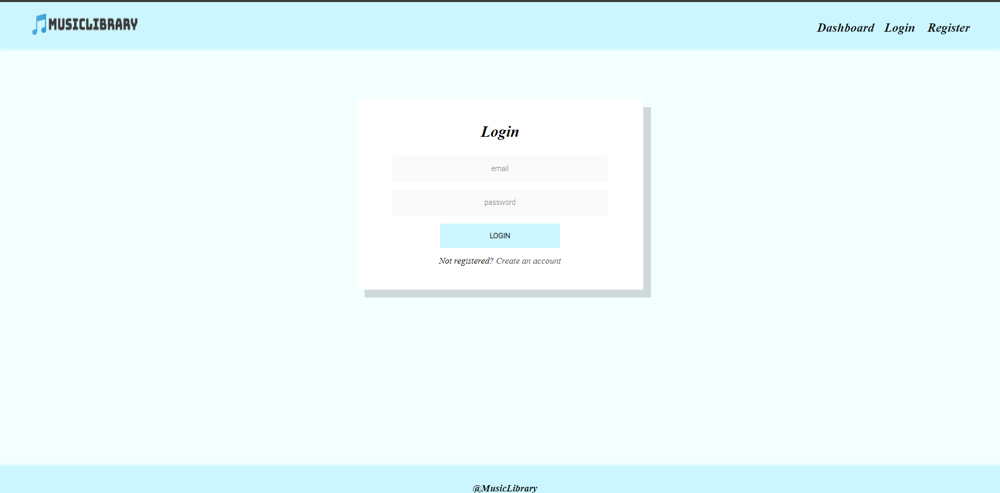
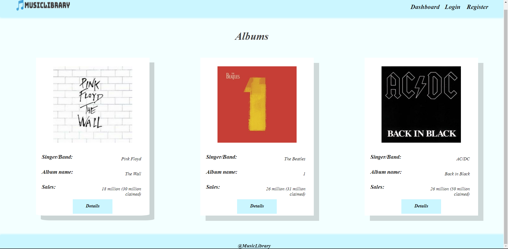
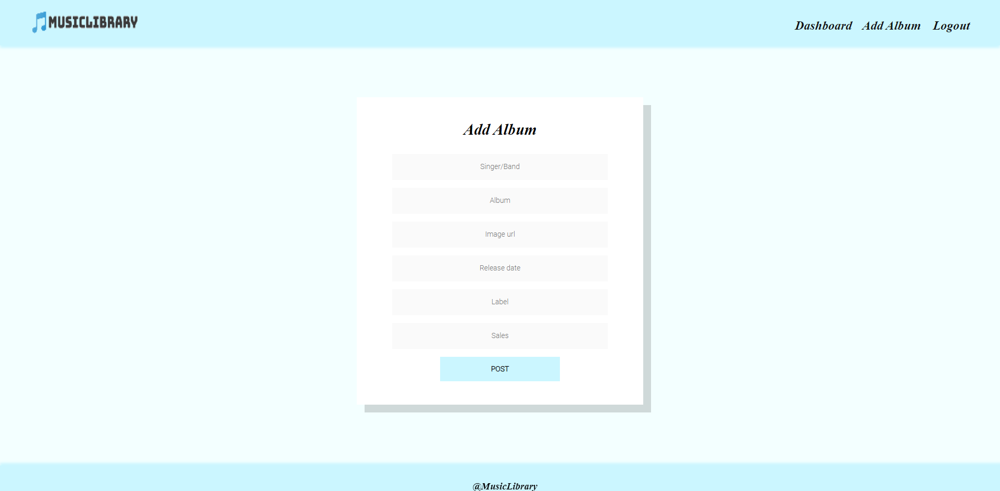
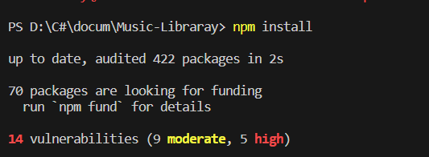
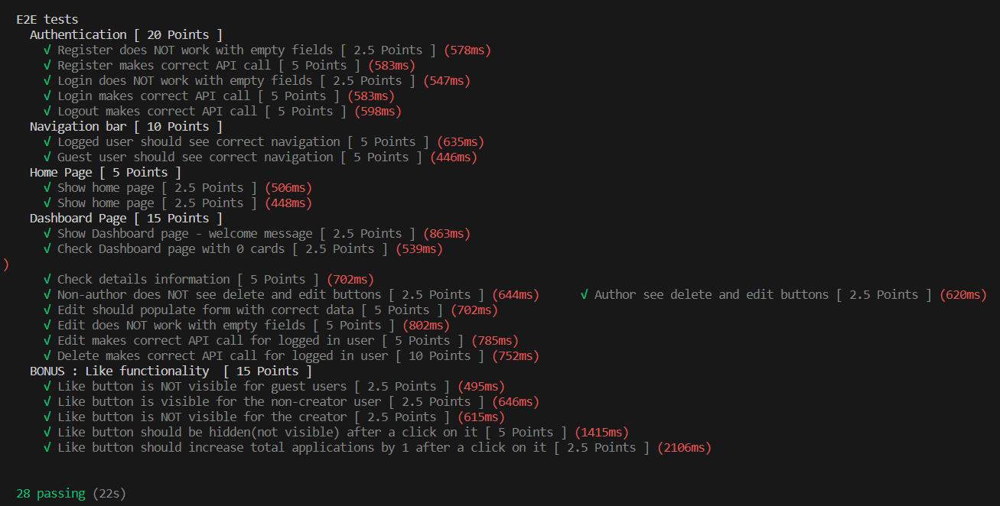
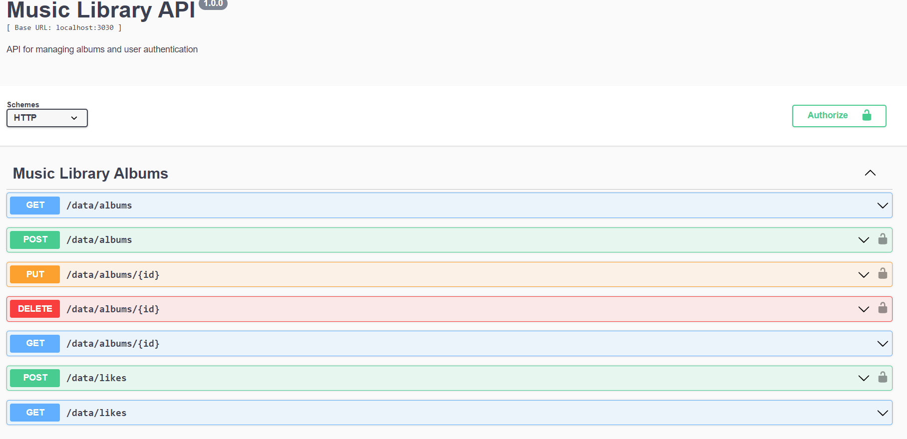

# Music Library

##Overview
**Music Library** is a front-end Single Page Application (**SPA**) which is for **creating** and **managing** music albums. The application allows the users to browe through an albums catalog. For registration useres have to provide their e-mail's and a password of their choice to create an album card. The album authors can also edir or delete their own publications at any time

# Music Library Web App

## SPA "Music Library" purpose is to create catalog of albums
- Techologies used for creating it: JS, HTML, CSS, Node.js, Express.js, Mocha, Chai

## Pages
There is the homepage, the register page, the login page, the dashboard page, a detail page and editing page.

## Homepage

](images/Screenshot_2024-02-23_113417.png)

## Register page

## Login page

## Dashboard page

## Album Add

## How to start the app.
- Firstly you must install the dependencies in the package.json with typing the command "npm install" in the terminal. After doing so use the command "npm start" in the terminal and the app will start.

## Tests

In order to run tests the web server should be operation. If you want to start it use "npm run start".

This is a one time operation. 

To execute tests you have to use "npm run test".

The test results will be displayed in the terminal. The operation can be performed unlimited amount of time.

## RESTful API

After we start the app we can check the RESTful API documentation here: http://localhost:3300/api-docs

These are the supported endpoints:

- GET /data/albums?sortBy=_createdOn%20desc - list all albums

- GET /data/albums/:id - returns an album by id 

- POST /data/albums - create a new album: e.g. { "singer": "Taylor Swift", "album": "Midnights", "imageUrl": "https://upload.wikimedia.org/wikipedia/en/9/9f/Midnights_-_Taylor_Swift.png", "release":"October 21, 2022", "label": "Republic", "sales": "1.58 million copies"}

- POST /data/albums/:id - edit by id e.g. { "singer": "Taylor Swift", "album": "Midnights", "imageUrl": "https://upload.wikimedia.org/wikipedia/en/9/9f/Midnights_-_Taylor_Swift.png", "release":"October 21, 2022", "label": "Republic", "sales": "1.58 million copies"}

- DELETE /data/albums/:id - delete by id

- POST /users/login - logs in an existing user

- POST /users/refister - registers a new user

- GET /users/logout - logs out an existing user

- POST /data/likes - add a like into album.

- GET /data/likes?where=albumId%3D%22{**albumID**}%22distinct=_ownerId&count - gets total likes

- GET /data/likes?where=albumId%3D%22{**albumID**}%22%20and%20_ownerId%3D%22{**userId**}%22&count - gets a number of likes for an album for specific user

All functions can be found in this GitHub repo: 
https://github.com/BoyanMilenkov/SfMsLib.git

